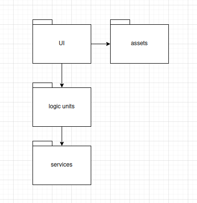
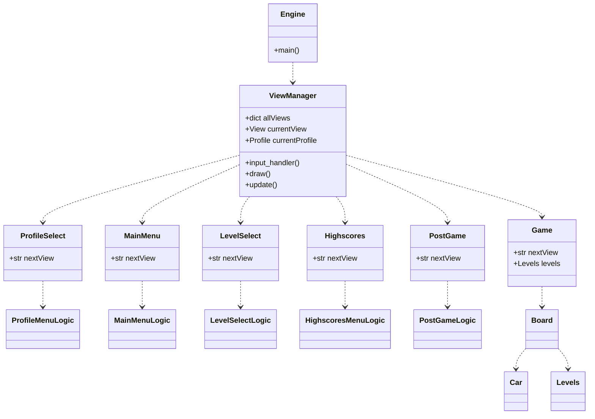
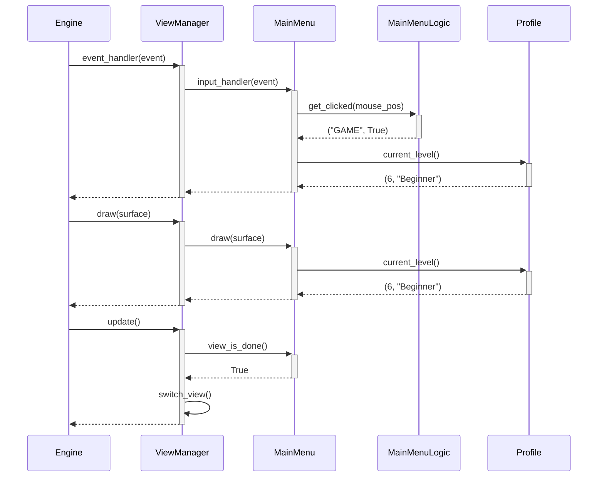

# Architecture

## Package diagram

The UI package handles the user interface and uses assets from the assets package to draw them. It also receives the pygame events and then distributes them to the logic units package for processing. The logic units package in turn uses classes and functions from the services package.

## Class diagram

The core of the program is comprised of roughly four levels of classes. The main pygame loop is in the Engine class and it uses the ViewManager class to process the user inputs and drawing of the game screen. The ViewManager always has an active View, through which it handles these tasks. 

Input handling is done by passing on the pygame event to the active View which uses its own LogicUnit and assisting services classes to process the event and make necessary changes to the View's status.

Drawing is done by the Engine making a draw call down the chain and supplying the surface onto which everything is drawn. When everything is drawn onto the surface, the Engine scales it according to the set game resolution and updates it onto the display.

At the end of every loop, the Engine calls an update function to the Viewmanager, which in turn checks if the current View's status is done. If it is, the ViewManager saves the necessary status info and passes it to the next View once it has done the switch. This way we can have status information that is active regardless of the current View.

## Sequence diagram of one loop in the main menu where "continue" is clicked

