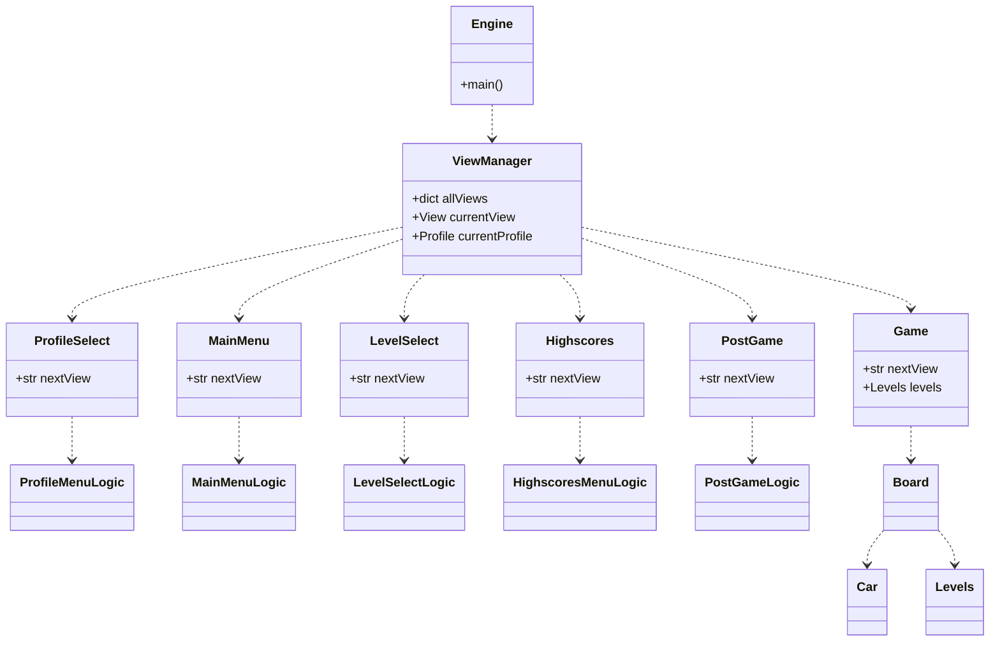
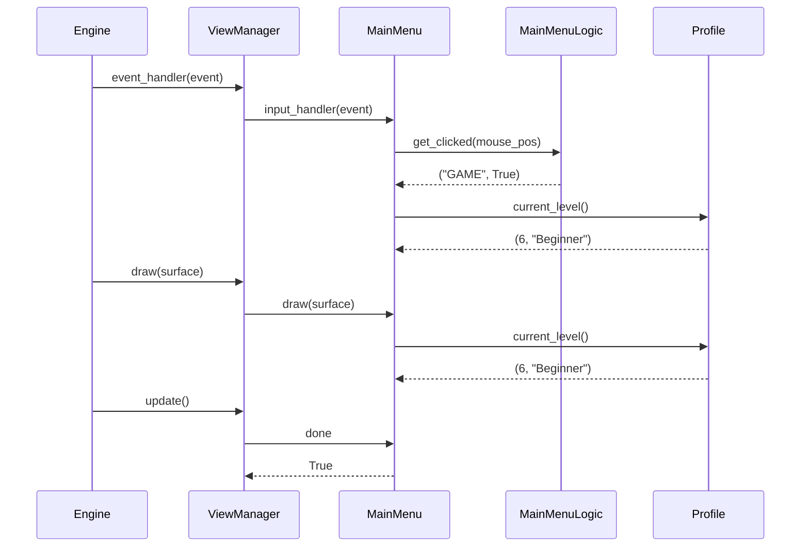

# Architecture

## Package diagram

## Class diagram

```mermaid
    classDiagram
        Engine ..> ViewManager
        Engine: +main()
        ViewManager: +dict allViews
        ViewManager: +View currentView
        ViewManager: +Profile currentProfile
        ViewManager ..> ProfileSelect
        ProfileSelect ..> ProfileMenuLogic
        ProfileSelect: +str nextView
        ViewManager ..> MainMenu
        MainMenu ..> MainMenuLogic
        MainMenu: +str nextView
        ViewManager ..> LevelSelect
        LevelSelect: +str nextView
        LevelSelect ..> LevelSelectLogic
        ViewManager ..> Highscores
        Highscores: +str nextView
        Highscores ..> HighscoresMenuLogic
        ViewManager ..> PostGame
        PostGame: +str nextView
        PostGame ..> PostGameLogic
        ViewManager ..> Game
        Game: +str nextView
        Game: +Levels levels
        Game ..> Board
        Board ..> Car
        Board ..> Levels
```
## Sequence diagram of one loop in the main menu where "continue" is clicked

```mermaid
    sequenceDiagram
        participant Engine
        participant ViewManager
        participant MainMenu
        participant MainMenuLogic
        participant Profile
        Engine ->> ViewManager: event_handler(event)
        ViewManager ->> MainMenu: input_handler(event)
        MainMenu ->> MainMenuLogic: get_clicked(mouse_pos)
        MainMenuLogic -->> MainMenu: ("GAME", True)
        MainMenu ->> Profile: current_level()
        Profile -->> MainMenu: (6, "Beginner")
        Engine ->> ViewManager: draw(surface)
        ViewManager ->> MainMenu: draw(surface)
        MainMenu ->> Profile: current_level()
        Profile -->> MainMenu: (6, "Beginner")
        Engine ->> ViewManager: update()
        ViewManager ->> MainMenu: done
        MainMenu -->> ViewManager: True

```
