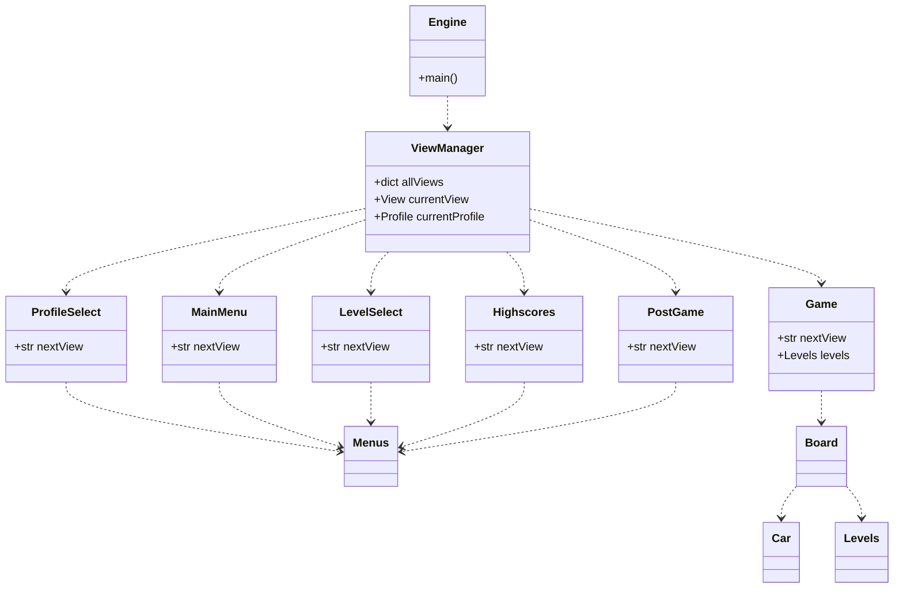

# Arkkitehtuurikuvaus

## Luokkarakenne

```mermaid
    classDiagram
        Engine ..> ViewManager
        Engine: +main()
        ViewManager: +dict allViews
        ViewManager: +View currentView
        ViewManager: +Profile currentProfile
        ViewManager ..> ProfileSelect
        ProfileSelect ..> Menus
        ProfileSelect: +str nextView
        ViewManager ..> MainMenu
        MainMenu ..> Menus
        MainMenu: +str nextView
        ViewManager ..> LevelSelect
        LevelSelect: +str nextView
        LevelSelect ..> Menus
        ViewManager ..> Highscores
        Highscores: +str nextView
        Highscores ..> Menus
        ViewManager ..> PostGame
        PostGame: +str nextView
        PostGame ..> Menus
        ViewManager ..> Game
        Game: +str nextView
        Game: +Levels levels
        Game ..> Board
        Board ..> Car
        Board ..> Levels
```
