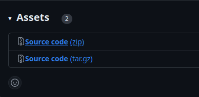
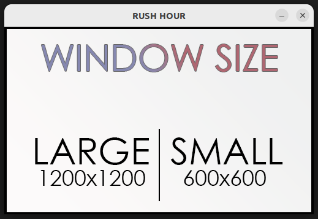
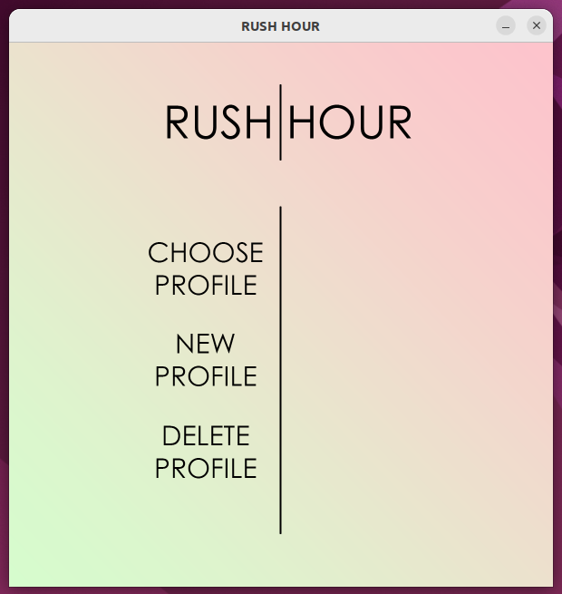
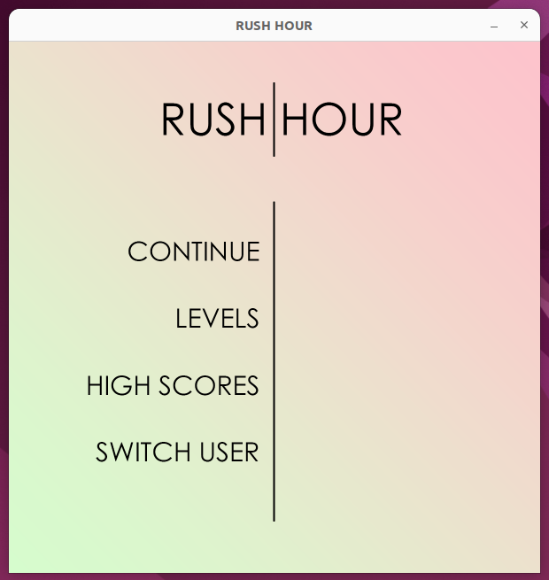
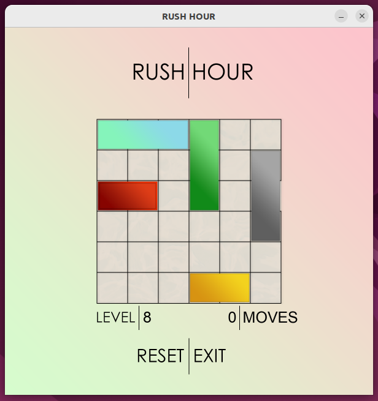
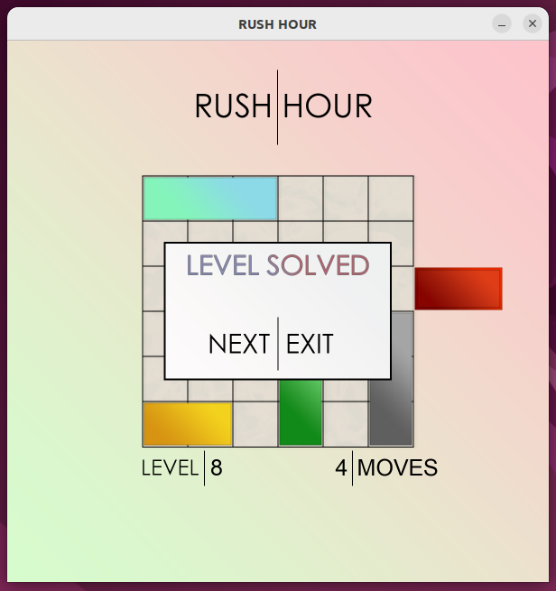
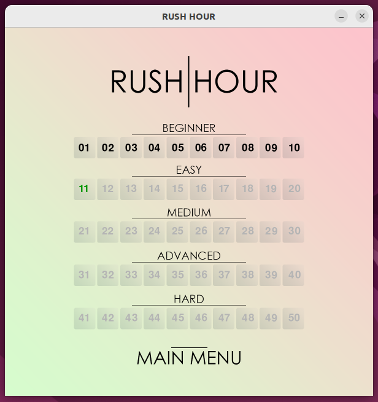
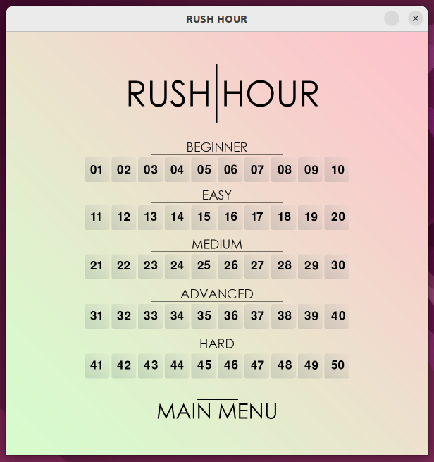
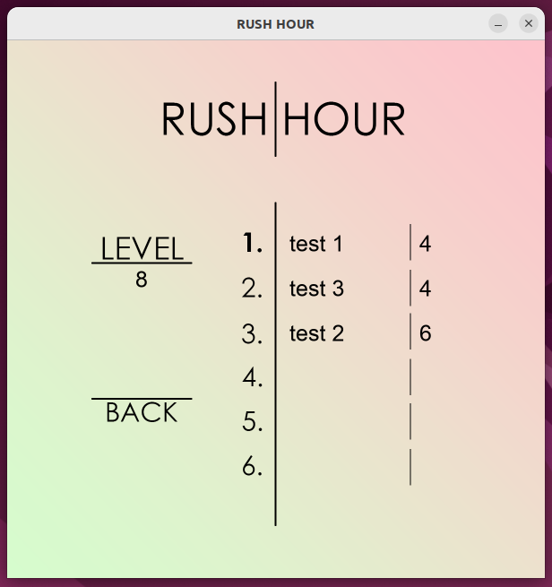

# Käyttöohje

## Ohjelman lataaminen ja käynnistäminen

1. Lataa projektin viimeisin release [Source code (zip)].



2. Asenna projektin riippuvuudet komennolla:
```
poetry install
```
3. Voit nyt käynnistää sovelluksen komennolla:
```
poetry run invoke start
```

## Sovelluksen käyttäminen

### RESOLUUTION VALINTA

Sovellus avaa ensimmäisenä valikon, missä voit valita peli-ikkunan resoluution, eli koon näytölläsi: 



### PROFIILIN VALINTA

Seuraavaksi näkyviin avautuu profiilinäkymä. Tässä näkymässä voit

    1. valita jo olemassa olevan profiilin.
    2. luoda uuden profiilin.
    3. poistaa olemassa olevan profiilin.



1. Voit valita profiilin klikkaamalla ensin "CHOOSE PROFILE" -painiketta, jolloin olemassa olevat profiilit näkyvät näytön oikealla laidalla ja voit valita haluamasi profiilin klikkaamalla sen nimeä.

2. Uuden profiilin luominen onnistuu klikkaamalla "NEW PROFILE" -painiketta ja sen jälkeen kirjoittamalla käyttäjänimi (max. 10 merkkiä) ja painamalla näppäimistön "ENTER"-painiketta.

3. Profiilin poistaminen tapahtuu painamalla "DELETE PROFILE" -painiketta ja sen jälkeen valitsemalla poistettava profiili listalta. Sovellus kysyy vielä varmistuksen ennen kuin profiili poistetaan.

### PÄÄVALIKKO

Kun olet valinnut profiilin, avautuu sinulle seuraavaksi sovelluksen päävalikko. Päävalikossa on seuraavat vaihtoehdot:

    1. Jatkaa pelaamista seuraavasta läpäisemättömästä tasosta.
    2. Avata tasovalikon.
    3. Avata "Highscores"-valikon mistä näet parhaat tulokset.
    4. Vaihtaa aktiivista käyttäjäprofiilia.



1. Valitsemalla "CONTINUE" sovellus avaa pelinäkymän ja lataa seuraavan ratkaisemattoman tason.
2. Valitsemalla "LEVELS" sinulle avautuu tasovalikko, mistä voit valita haluamasi jo ratkaissun tason pelattavaksi.
3. Valitsemalla "HIGH SCORES" pääset näkymään, missä voit katsoa jokaisen tason parhaita pisteitä.
4. Valitsemalla "SWITCH USER" pääset takaisin profiilivalikkoon.

### PELINÄKYMÄ

Pelinäkymä on seuraavan näköinen:



Pelaaminen:

    - Tarkoituksena on saada punainen auto ulos pelilaudalta mahdollisimman vähilla siirroilla.
    - Voit liikuttaa autoja vetämällä niitä hiirellä. 
        - Autot liikkuvat ainoastaan pituusakselinsa suuntaisesti.
        - Autot eivät voi liikkua toisten päälle tai yli.

Näkymän painikkeet:

1. Pääset takaisin päävalikkoon painamalla "EXIT".
2. Voit nollata tason tilanteen ja siirrot painamalla "RESET".

Tason läpäisyn jälkeen:



1. Voit siirtyä pelaamaan seuraavaa tasoa painamalla "NEXT".
2. Pääset takaisin päävalikkoon vlaitsemalla "EXIT".


### TASOVALIKKO

Tasovalikossa voit valita tason tai palata takaisin päävalikkoon.



1. Voit valita tason pelattavaksi klikkaamalla sitä valikossa.
    - Voit vlaita ainoastaan tason jonka olet jo läpäissyt tai seuraavan läpäisemättömän tason.
    - Valikossa näkyy tummennettuna jo läpäistyt tason, ja vihreällä seuraava läpäisemätön taso.
    - Harmaalla näkyvät tasot joita et ole päässyt läpi etkä voi vielä pelata.
2. Pääset takaisi päävalikkoon klikkaamalla "MAIN MENU" -painiketta.

### PARHAAT TULOKSET

Ensimmäisenä näkyviin avautuu tasovalikko, mistä voit valita tason tarkasteltavaksi.



1. Tasovalikosta poiketen voit valita minkä tahansa tason.
2. Päävalikkoon pääset painamalla "MAIN MENU" -painiketta.

Kun olet valinnut tarkasteltavan tason, aukeaa sinulle seuraava näkymä:



Näet näkymässä valitun tason, ja jokaisen olemassa olevan profiilin parhaan tuloksen kyseiselle tasolle, jos ne ovat tason läpäisseet.

1. Pääset takaisin aiempaan näkymään painamalla "BACK"-painiketta