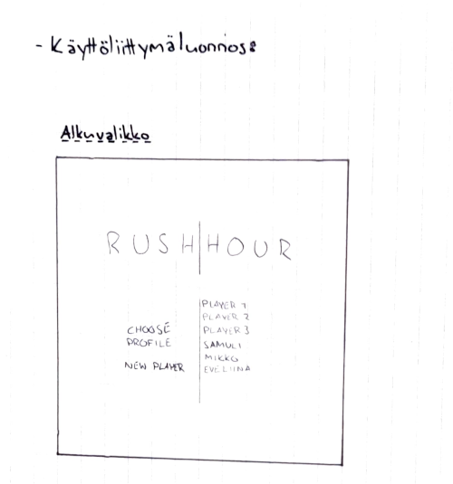
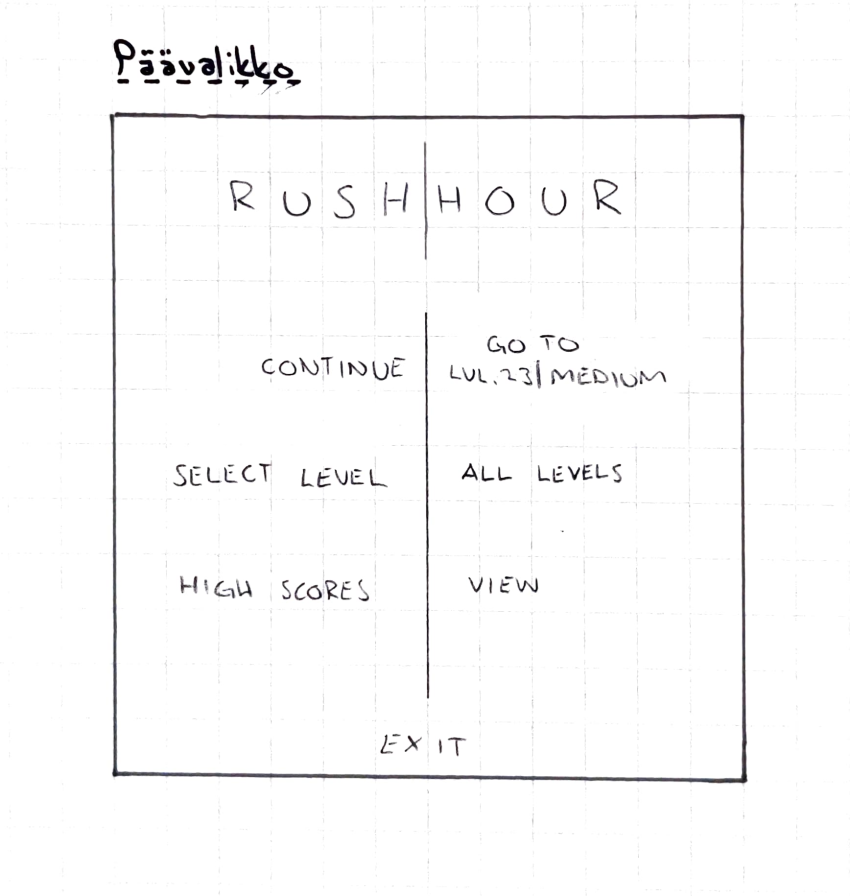
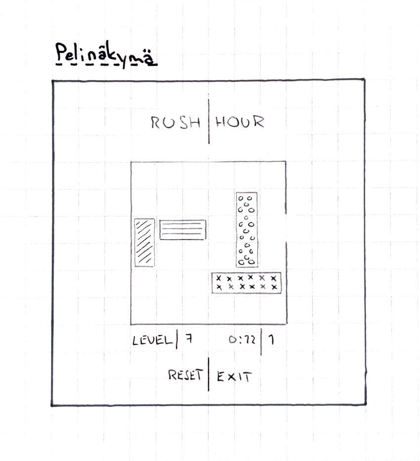

# Vaatimusmäärittely

## Sovelluksen tarkoitus

Tarkoituksena on viihdyttävä ongelmanratkaisupeli, jossa on useita tasoja joiden vaativuustaso kasvaa niiden mukana. Peliin on tarkoitus voida luoda käyttäjäprofiili ja tallentaa eteneminen ja tasokohtaiset ennätykset.

## Käyttäjät

Alkuvaiheessa pelissä ei ole valmiiksi luotuja käyttäjiä. Jokainen peliä pelaava henkilö luo itselleen käyttäjänimen aloittaessaan pelaamisen.

## Käyttöliittymäluonnos

  

## Toiminnallisuus

### Pelin tekninen  perusidea

- (✓) Pelissä on 6x6 ruudukko, johon on sijoitettu erikokoisia (suorakaiteen muotoisia, leveydeltään maksimissaan 1 ja pituudeltaan 2-3) palikoita, joko x-akselilla tai y-akselilla.
- (✓) Palikat voivat liikkua ruudukossa vain sillä akselilla jonka suuntaisesti ne ovat, ja vain tyhjiin ruutuihin.
- (✓) Yksi palikoista on ns. pelaajan oma palikka, ja pelin ideana on saada tämä pelinappula ulos ruudukosta. Pelinappula on aina tietyllä x-akselilla ja kyseisen rivin oikeassa reunassa on peliruudukon seinässä aukko, josta pelinappulan voi saada ulos ruudukosta.
- (✓) Pelinappuloita on sijoitettu ruudukkoon tietty määrä tiettyihin paikkohin, joilla saadaan luotua tietyn vaikeustason ongelma.

### Pelin lisäominaisuudet

- (✓) Peli mittaa tason ratkaisemiseen kuluneen siirtojen määrän. Niiden pohjalta luodaan HIGH SCORE -taulukko.
- (✓) Peli tallentaa jokaisen käyttäjän etenemisen, ja pelaajat voivat jatkaa siitä tasosta mihin edellisellä pelikerralla jäivät.
- (✓) Pelaajat voivat myös valita tietyn jo ratkaisseensa tason, jos haluavat yrittää parempaa tulosta.

### Jatkokehitysideoita

- Mahdollisuus luoda itse uusia tasoja.
- Mahdollisuus vaihtaa pelin ulkoasua eri teemoilla.

### Käyttöliittymä

- (✓) Peli pyytää käynnistettäessä valitsemaan tai luomaan uuden käyttäjäprofiilin, jonka jälkeen siirrytääm päävalikkoon. Myös profiilin poistaminen on mahdollista.
- (✓) Päävalikosta voi jatkaa pelaamista seuraavasta ratkaisemattomasta tasosta, valita jo ratkaistun tason, nähdä HIGH SCOREt tai vaihtaa profiilia.
- Peli-ikkunan koon voi vaihtaa.
