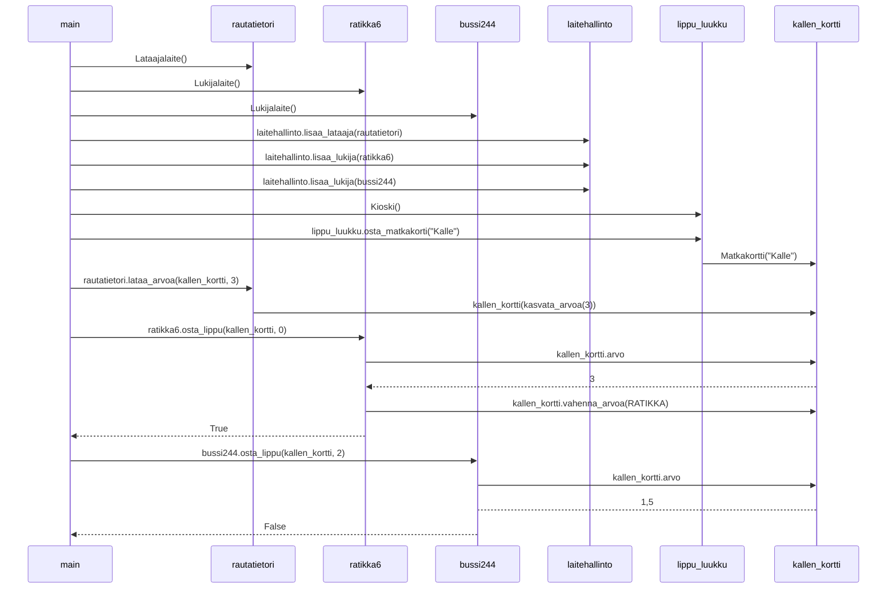

```mermaid
    sequenceDiagram
        main ->> rautatietori: Lataajalaite()
        main ->> ratikka6: Lukijalaite()
        main ->> bussi244: Lukijalaite()
        main ->> laitehallinto: laitehallinto.lisaa_lataaja(rautatietori)
        main ->> laitehallinto: laitehallinto.lisaa_lukija(ratikka6)
        main ->> laitehallinto: laitehallinto.lisaa_lukija(bussi244)
        main ->> lippu_luukku: Kioski()
        main ->> lippu_luukku: lippu_luukku.osta_matkakorti("Kalle")
        lippu_luukku ->> kallen_kortti: Matkakortti("Kalle")
        main ->> rautatietori: rautatietori.lataa_arvoa(kallen_kortti, 3)
        rautatietori ->> kallen_kortti: kallen_kortti(kasvata_arvoa(3))
        main ->> ratikka6: ratikka6.osta_lippu(kallen_kortti, 0)
        ratikka6 ->> kallen_kortti: kallen_kortti.arvo
        kallen_kortti -->> ratikka6: 3
        ratikka6 ->> kallen_kortti: kallen_kortti.vahenna_arvoa(RATIKKA)
        ratikka6 -->> main: True
        main ->> bussi244: bussi244.osta_lippu(kallen_kortti, 2)
        bussi244 ->> kallen_kortti: kallen_kortti.arvo
        kallen_kortti --> bussi244: 1,5
        bussi244 -->> main: False
        


```