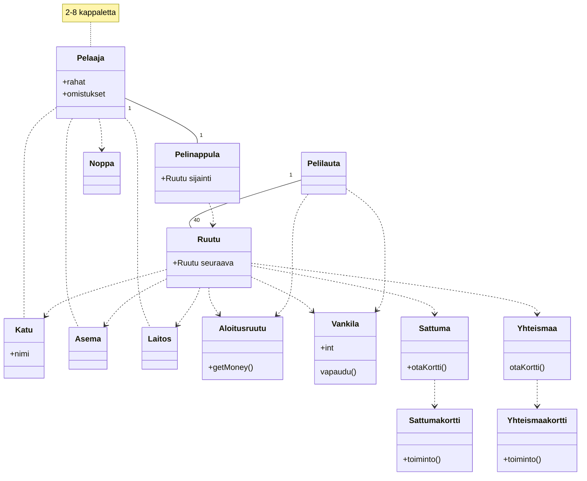

```mermaid
    classDiagram
        Pelilauta "1" -- "40" Ruutu
        Pelinappula ..> Ruutu
        Pelinappula: +Ruutu sijainti
        Pelaaja "1" -- "1" Pelinappula
        note for Pelaaja "2-8 kappaletta"
        Pelaaja ..> Noppa
        Pelaaja: +rahat
        Pelaaja: +omistukset
        Pelaaja .. Katu
        Pelaaja .. Asema
        Pelaaja .. Laitos
        Ruutu ..> Aloitusruutu
        Aloitusruutu: +getMoney()
        Ruutu ..> Vankila
        Vankila: +int 
        Vankila: vapaudu()
        Ruutu ..> Sattuma
        Ruutu ..> Yhteismaa
        Ruutu ..> Asema
        Ruutu ..> Laitos
        Ruutu ..> Katu
        Katu: +nimi
        Ruutu: +Ruutu seuraava
        Pelilauta ..> Vankila
        Pelilauta ..> Aloitusruutu
        Sattuma ..> Sattumakortti
        Sattuma: +otaKortti()
        Sattumakortti: +toiminto()
        Yhteismaa ..> Yhteismaakortti
        Yhteismaa: otaKortti()
        Yhteismaakortti: +toiminto()
        
```