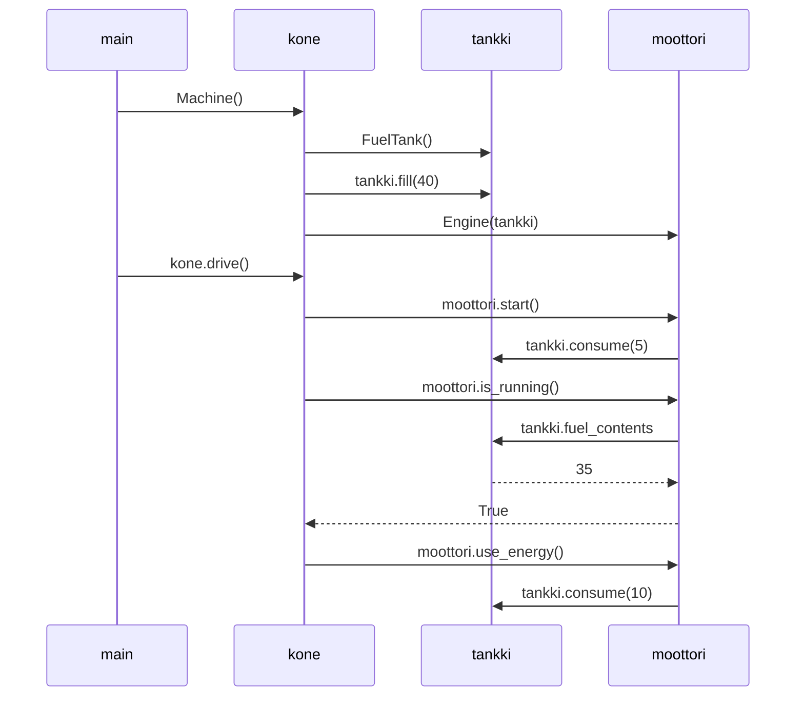

```mermaid
    sequenceDiagram
        main ->> kone: Machine()
        kone ->> tankki: FuelTank()
        kone ->> tankki: tankki.fill(40)
        kone ->> moottori: Engine(tankki)
        main ->> kone: kone.drive()
        kone ->> moottori: moottori.start()
        moottori ->> tankki: tankki.consume(5)
        kone ->> moottori: moottori.is_running()
        moottori ->> tankki: tankki.fuel_contents
        tankki -->> moottori: 35
        moottori -->> kone: True
        kone ->> moottori: moottori.use_energy()
        moottori ->> tankki: tankki.consume(10)
        
        
```
